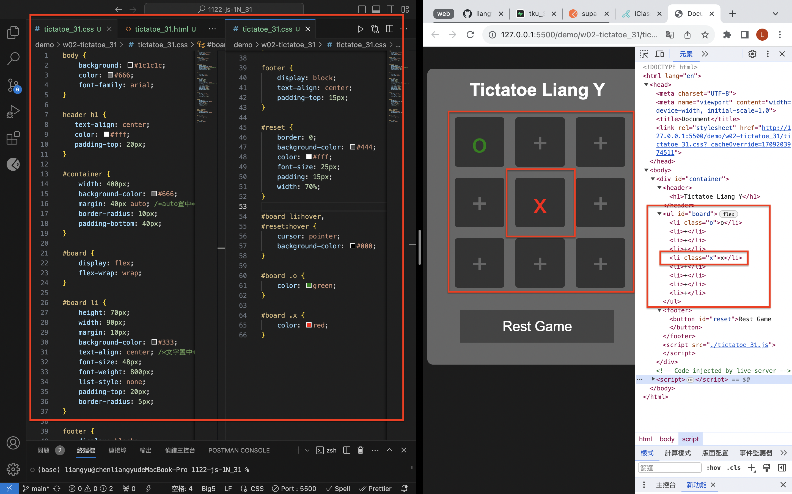
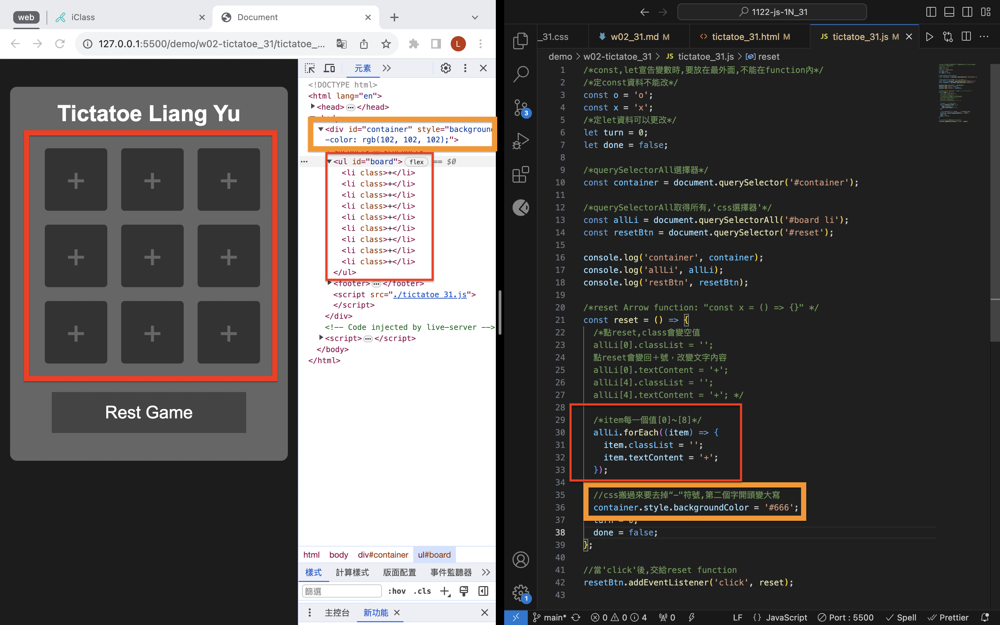
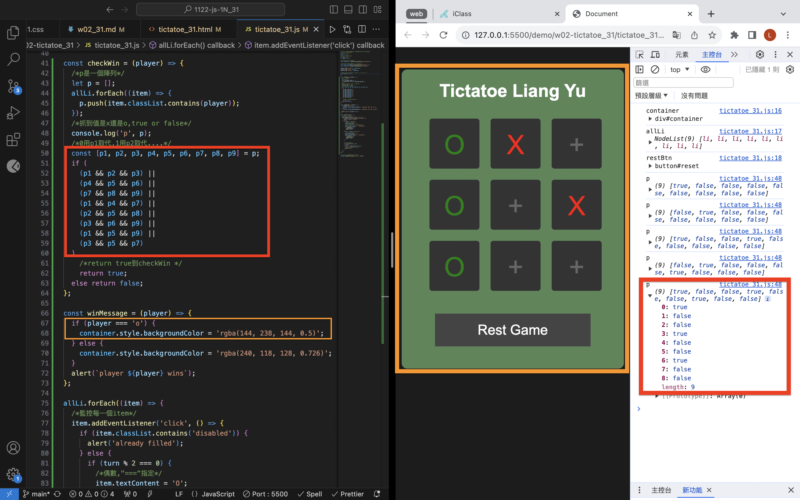
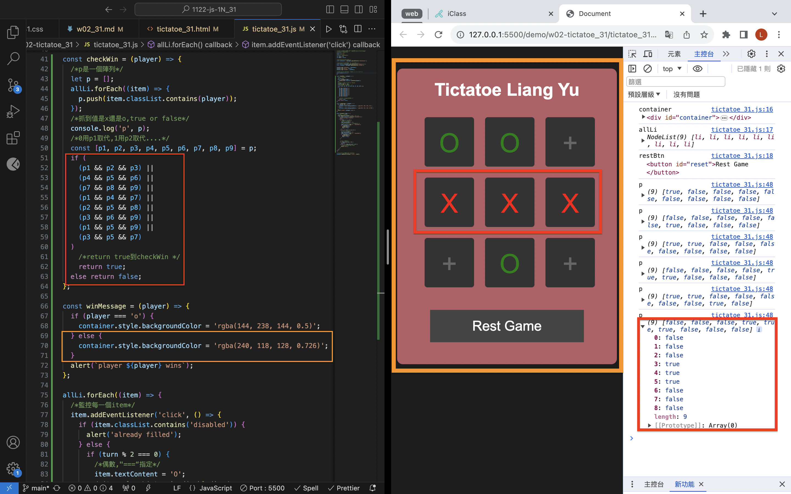
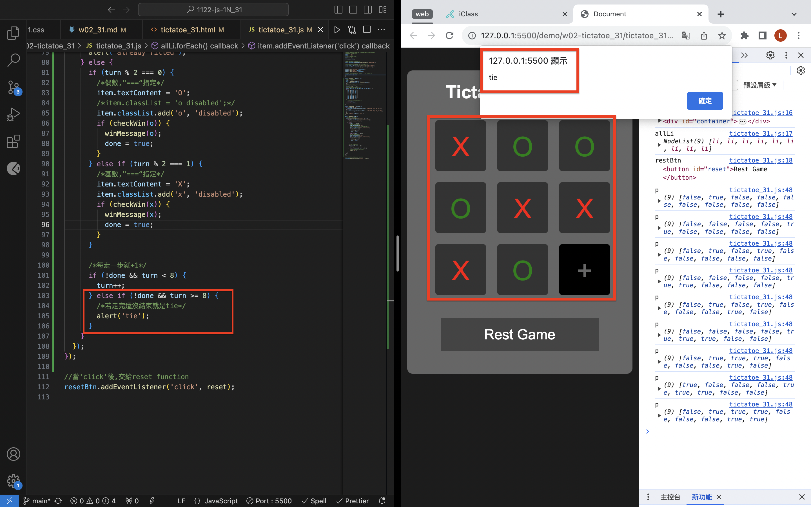

[Github](https://github.com/liangyu9103/1122-js-demo_31.git)

### W02-P1: Show Tictactoe css



```
4d4c174 陳亮瑜  Thu Feb 29 19:02:34 2024 +0800  ### W02-P1: Show Tictactoe css
```

### W02-P2: implement reset button



```
5ea6097 陳亮瑜  Thu Feb 29 19:59:15 2024 +0800  ### W02-P2: implement reset button
```

### W02-P3: implment checkWin(player), and winMessage(player)

#### => player O wins



#### => player X wins



#### => tie game



```
443eefe 陳亮瑜  Thu Feb 29 21:01:03 2024 +0800  ### W02-P3: implment checkWin(player), and winMessage(player)
```

### W02-Log:

```
git log --pretty=format:"%h%x09%an%x09%ad%x09%s" --after="2024-02-27"

443eefe 陳亮瑜  Thu Feb 29 21:01:03 2024 +0800  ### W02-P3: implment checkWin(player), and winMessage(player)
5ea6097 陳亮瑜  Thu Feb 29 19:59:15 2024 +0800  ### W02-P2: implement reset button
4d4c174 陳亮瑜  Thu Feb 29 19:02:34 2024 +0800  ### W02-P1: Show Tictactoe css

```
