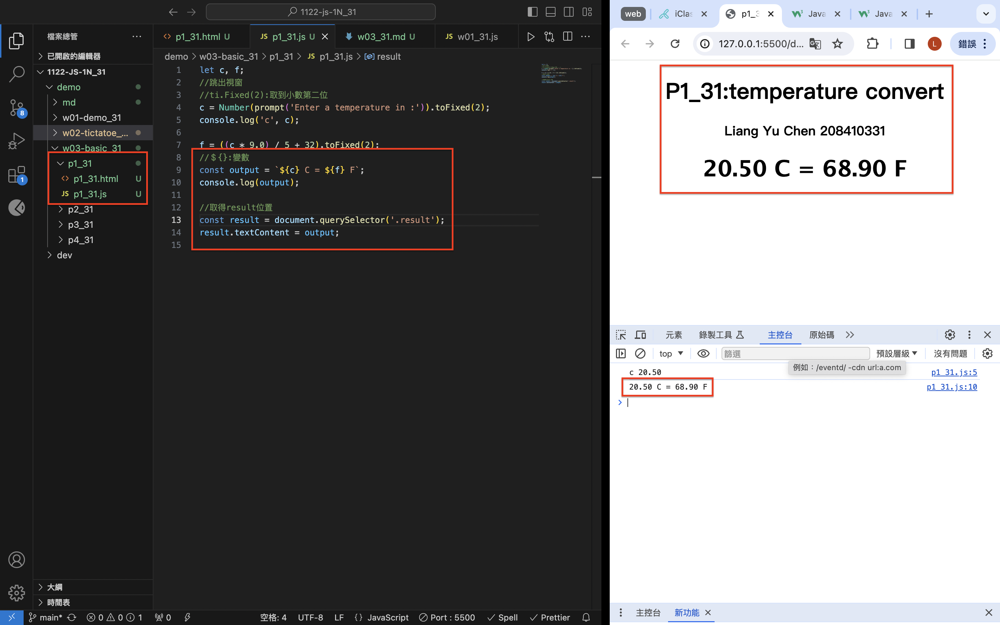
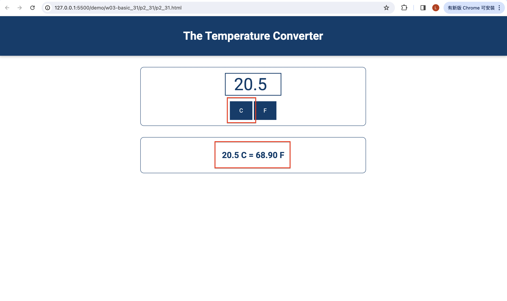
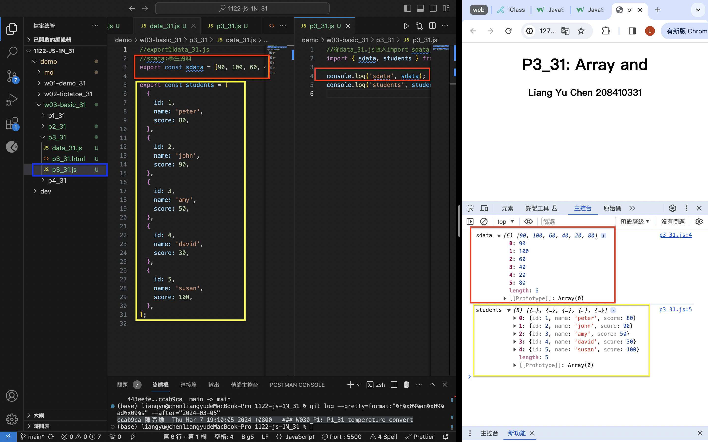
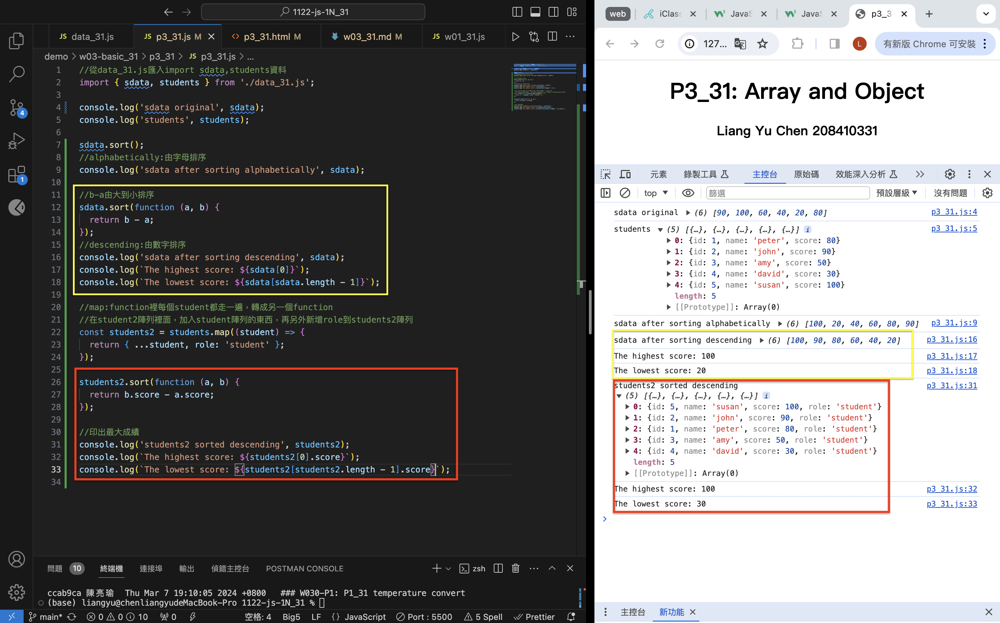

[Github](https://github.com/liangyu9103/1122-js-demo_31.git)

### W03-P1: P1_31 temperature convert



```
ccab9ca 陳亮瑜  Thu Mar 7 19:10:05 2024 +0800   ### W030-P1: P1_31 temperature convert
```

### W03-P2: P2_xx temperature convert using Web

##### => From C to F



##### => From F to C


```
7fde93b 陳亮瑜  Sat Mar 9 10:46:19 2024 +0800   ### W03-P2: P2_xx temperature convert using Web
```

### W03-P3: import sdata and students data from data_xx.js



```
354d654 陳亮瑜  Thu Mar 7 20:15:13 2024 +0800   ### W03-P3: import sdata and students data from data_xx.js

```

### W03-P4: Compute highest and lowest score of sdata and students2



```
2c77103 陳亮瑜  Thu Mar 7 20:53:12 2024 +0800   ### W03-P4: Compute highest and lowest score of sdata and students2
```

### W03-Log:

```
git log --pretty=format:"%h%x09%an%x09%ad%x09%s" --after="2024-03-05"

7fde93b 陳亮瑜  Sat Mar 9 10:46:19 2024 +0800   ### W03-P2: P2_xx temperature convert using Web
2c77103 陳亮瑜  Thu Mar 7 20:53:12 2024 +0800   ### W03-P4: Compute highest and lowest score of sdata and students2
354d654 陳亮瑜  Thu Mar 7 20:15:13 2024 +0800   ### W03-P3: import sdata and students data from data_xx.js
ccab9ca 陳亮瑜  Thu Mar 7 19:10:05 2024 +0800   ### W030-P1: P1_31 temperature convert

```
