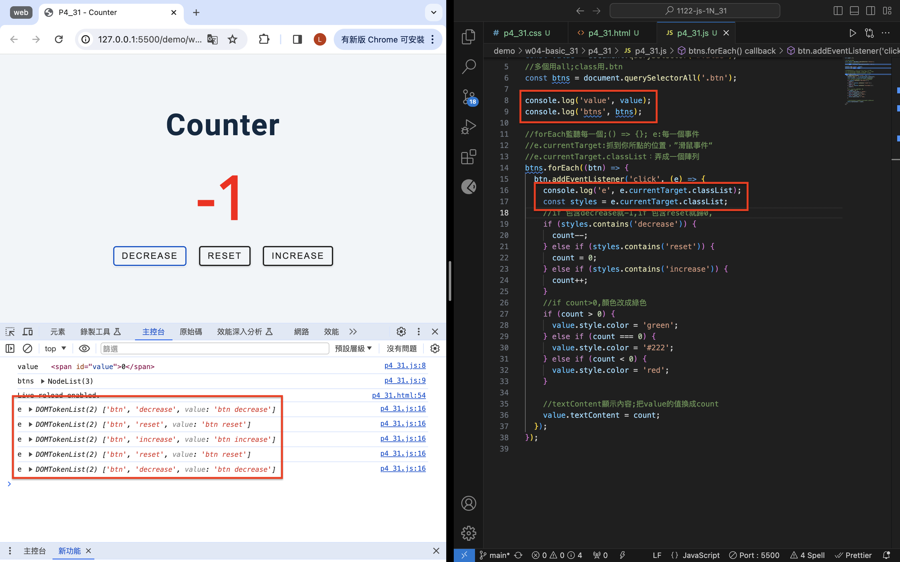
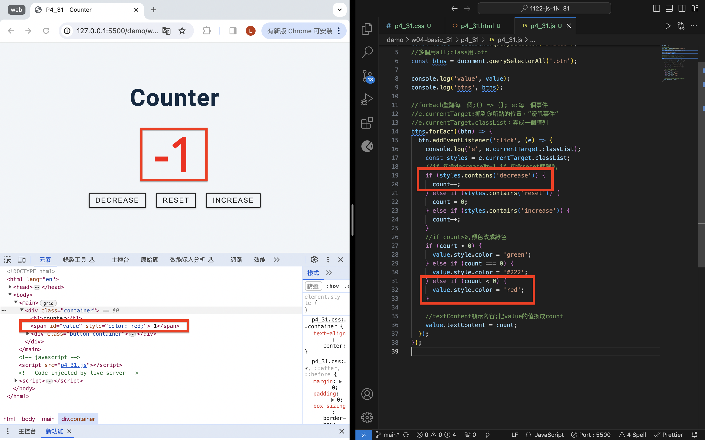
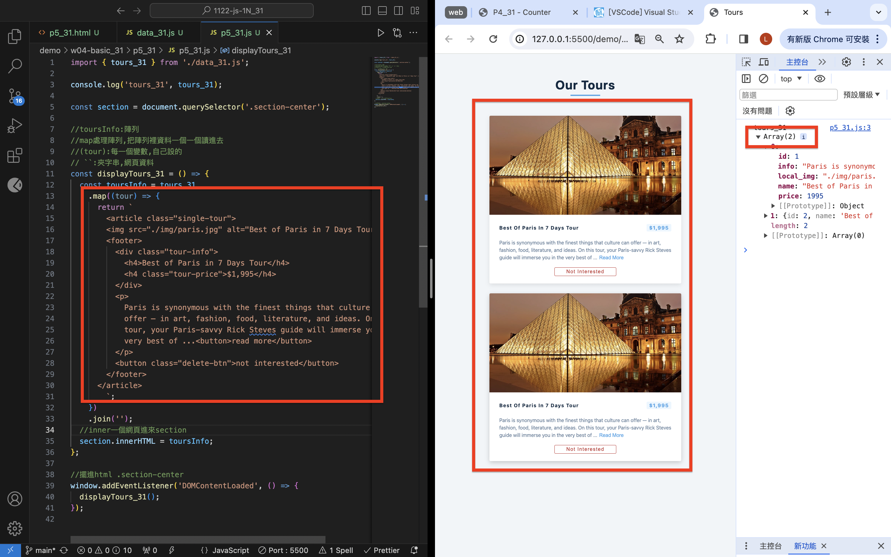
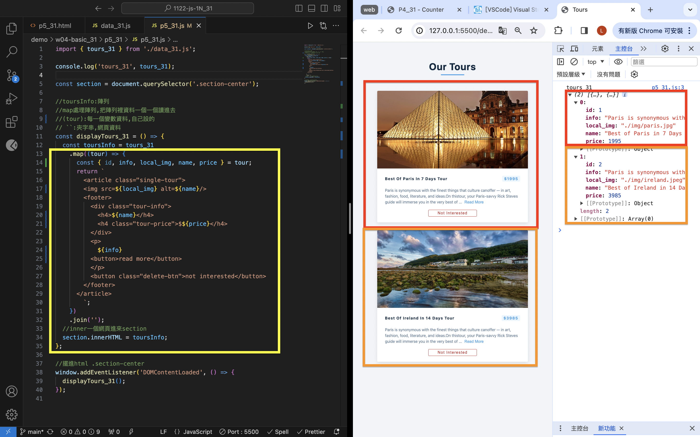
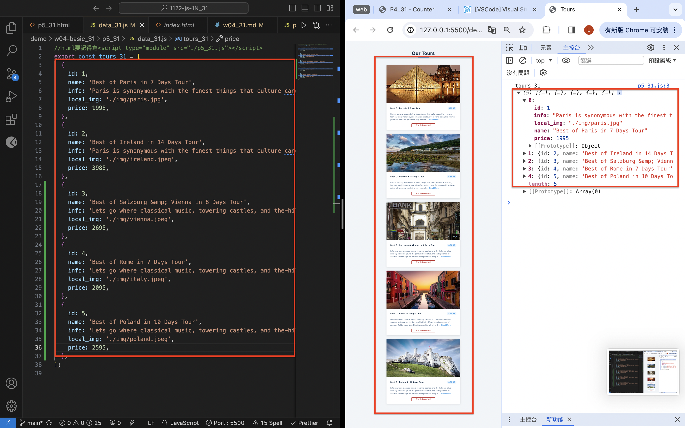
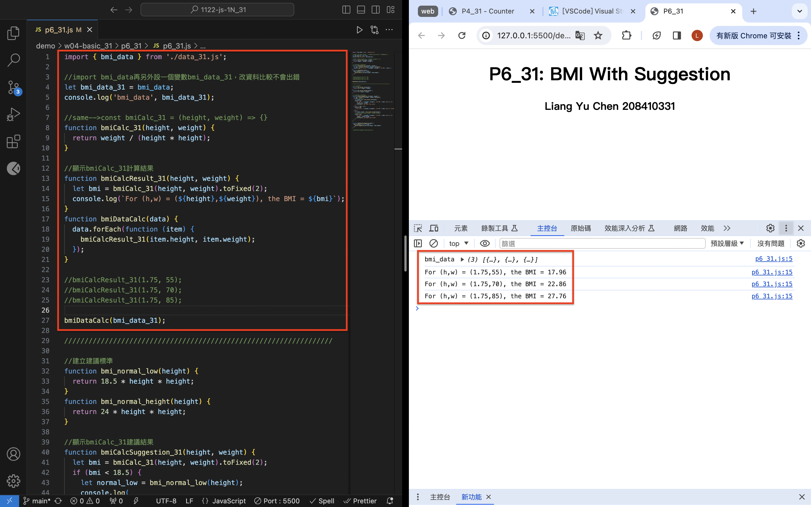
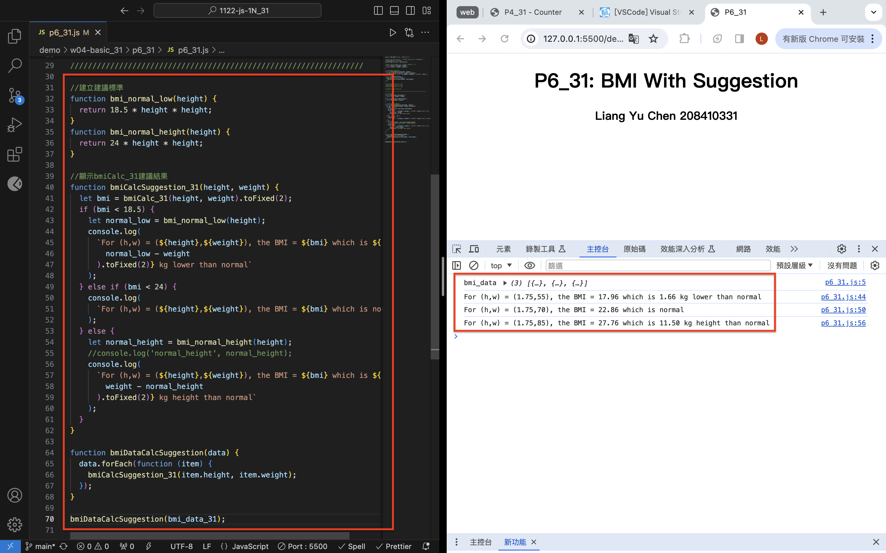

[Github](https://github.com/liangyu9103/1122-js-demo_31.git)

### W04-P1: P4_xx -- Counter Demo




```
b3be9ac 陳亮瑜  Thu Mar 14 19:09:11 2024 +0800  git log --pretty=format:%h%x09%an%x09%ad%x09%s --after=2024-03-13
```

### W04-P2: P5_xx -- Tours display two fixed data

- data.js 資料還沒進來，但因為 data.js 裡面有兩筆資料，所以會顯示兩筆，只是內容還是 p5_31.js 中 return 裡夾的資料



```
2a0e9e6 陳亮瑜  Thu Mar 14 19:56:26 2024 +0800  ### W04-P2: P5_xx -- Tours display two fixed data
```

### W04-P3: P5_xx -- Display 5 tours from data_xx.js (json array)

- 把資料用 const { id, info, local_img, name, price } = tour 解構，用${}放進程式




```
964d1aa 陳亮瑜  Thu Mar 14 20:26:10 2024 +0800  ## W04-P3: P5_xx -- Display 5 tours from data_xx.js (json array)
```

### W04-P4: P6_xx -- BMI Compute with Suggestion

#### => bmiDataCalc(bmi_data_xx);



#### => bmiDataCalcSuggestion(bmi_data_xx);



```
526cd2f 陳亮瑜  Thu Mar 14 21:22:52 2024 +0800  ### W04-P4: P6_xx -- BMI Compute with Suggestion
```

### W04-Log:

```
git log --pretty=format:"%h%x09%an%x09%ad%x09%s" --after="2024-03-13"

526cd2f 陳亮瑜  Thu Mar 14 21:22:52 2024 +0800  ### W04-P4: P6_xx -- BMI Compute with Suggestion
964d1aa 陳亮瑜  Thu Mar 14 20:26:10 2024 +0800  ## W04-P3: P5_xx -- Display 5 tours from data_xx.js (json array)
2a0e9e6 陳亮瑜  Thu Mar 14 19:56:26 2024 +0800  ### W04-P2: P5_xx -- Tours display two fixed data
b3be9ac 陳亮瑜  Thu Mar 14 19:09:11 2024 +0800  git log --pretty=format:%h%x09%an%x09%ad%x09%s --after=2024-03-13
```
