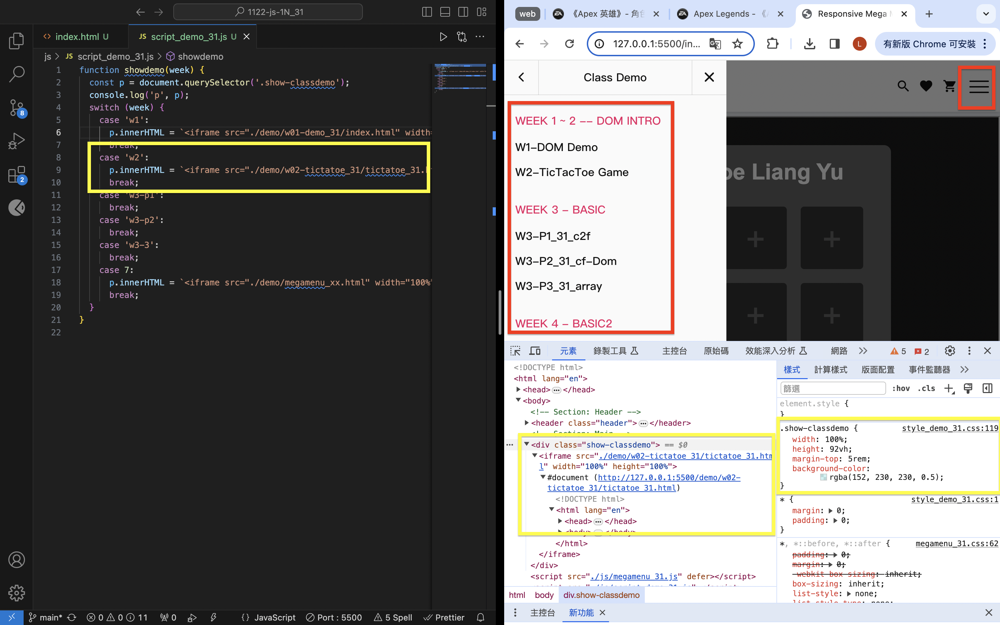
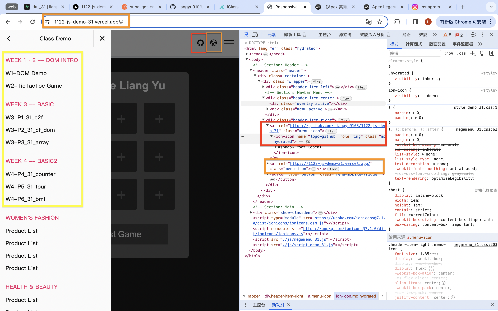
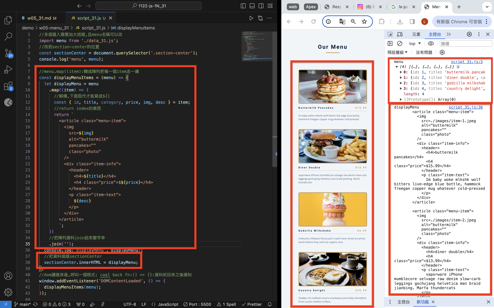
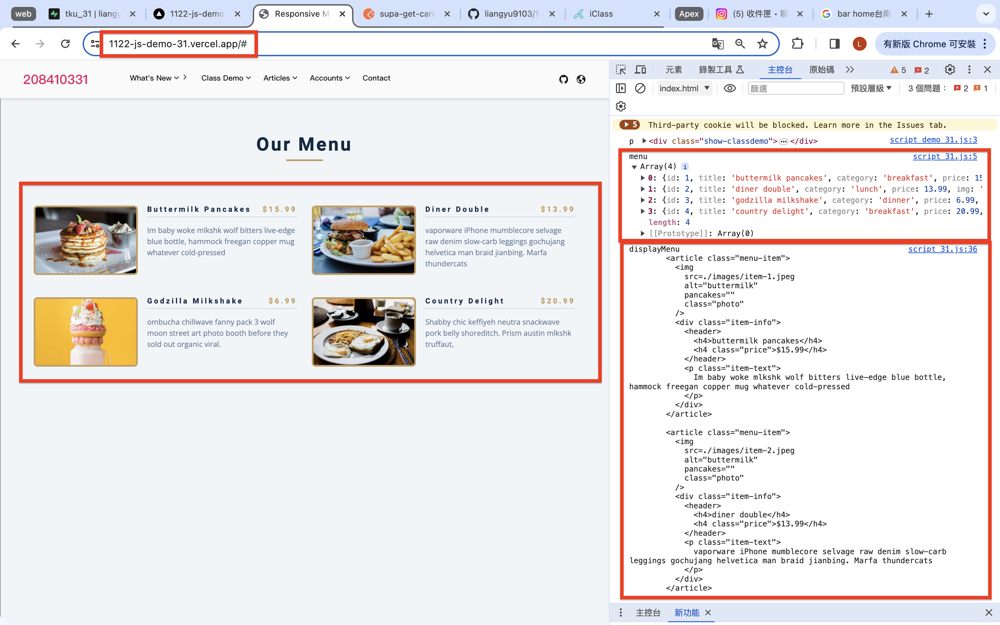
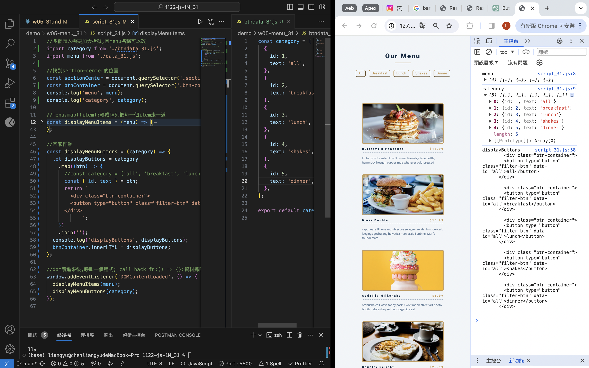

[Github](https://github.com/liangyu9103/1122-js-demo_31.git)
[Vercal](https://vercel.com/liangyu9103s-projects/1122-js-demo-31)

### W05-P1: Use megamenu to show class demo w1~W4 locally



```
8207be2 陳亮瑜  Thu Mar 21 19:02:54 2024 +0800  ### W05-P1: Use megamenu to show class demo w1~W4 locally
```

### W05-P2: Show W05-P1 in Vercel, add github and globe icons for Github and Vercel



```
88c8ecf 陳亮瑜  Thu Mar 21 19:37:08 2024 +0800  ### W05-P2: Show W05-P1 in Vercel, add github and globe icons for Github and Vercel
```

### W05-P3: Display Menu Items from menu json array on both local and Vercel

#### > local



#### > Vercel



```
4ed45d6 陳亮瑜  Thu Mar 21 20:56:14 2024 +0800  ### W05-P3: Display Menu Items from menu json array on both local and Vercel
```

### W05-P4: Display Menu buttons from categories array (do it by yourself)



```
9e3cf4f 陳亮瑜  Tue Mar 26 20:03:22 2024 +0800  ### W05-P4: Display Menu buttons from categories array (do it by yourself)
```

### W05-Log:

```
git log --pretty=format:"%h%x09%an%x09%ad%x09%s" --after="2024-03-19"

9e3cf4f 陳亮瑜  Tue Mar 26 20:03:22 2024 +0800  ### W05-P4: Display Menu buttons from categories array (do it by yourself)
4ed45d6 陳亮瑜  Thu Mar 21 20:56:14 2024 +0800  ### W05-P3: Display Menu Items from menu json array on both local and Vercel
b005f8d 陳亮瑜  Thu Mar 21 20:45:12 2024 +0800  add w5 code
88c8ecf 陳亮瑜  Thu Mar 21 19:37:08 2024 +0800  ### W05-P2: Show W05-P1 in Vercel, add github and globe icons for Github and Vercel
205632e 陳亮瑜  Thu Mar 21 19:32:17 2024 +0800  add url for global icon
877b41f 陳亮瑜  Thu Mar 21 19:22:01 2024 +0800  add github and vercal icon
8207be2 陳亮瑜  Thu Mar 21 19:02:54 2024 +0800  ### W05-P1: Use megamenu to show class demo w1~W4 locally
```
