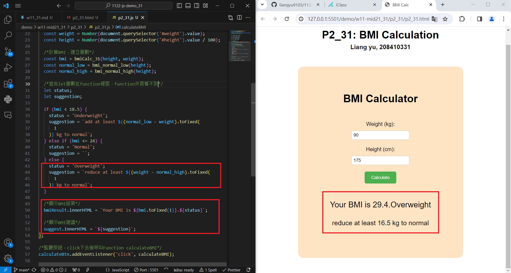
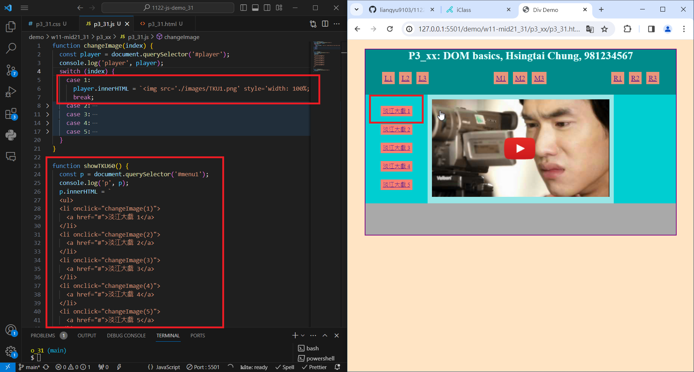
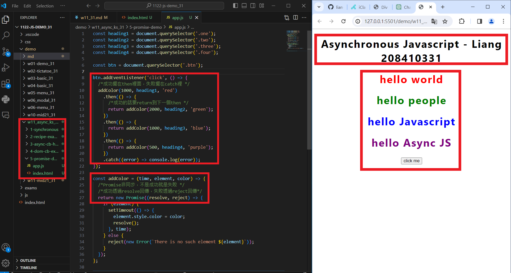
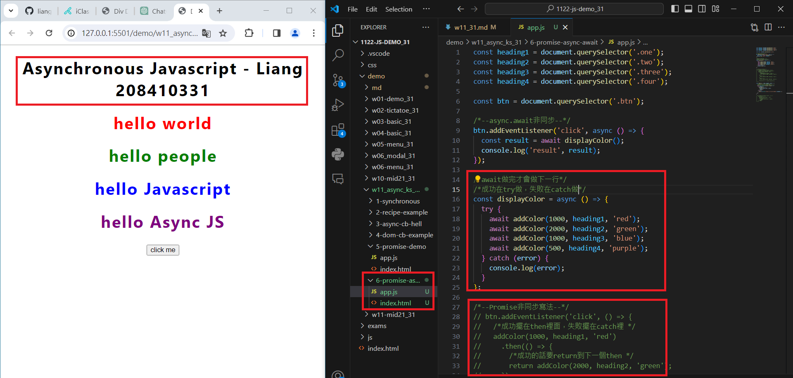

[Github](https://github.com/liangyu9103/1122-js-demo_31.git)
[Vercal](https://vercel.com/liangyu9103s-projects/1122-js-demo-31)

### W11-P1: Answer p2_xx in mid21



```
3c62618 liangyu9103     Thu May 2 19:14:41 2024 +0800   ### W11-P1: Answer p2_xx in mid21
```

### W11-P2: Answer p3_xx in mid21



```
ab69634 liangyu9103     Thu May 2 19:37:45 2024 +0800   ### W11-P2: Answer p3_xx in mid21
```

### W11-P3: Answer for '5-prommise-demo'



```
d311b2c liangyu9103     Thu May 2 20:47:40 2024 +0800   ### W11-P3: Answer for '5-prommise-demo'
```

### W11-P4: Answer for '6-promise-async-await'



```
f7c4766 liangyu9103     Thu May 2 21:07:48 2024 +0800   ### W11-P4: Answer for '6-promise-async-await'
```

### W11-P5: W11 all code

```
git log --pretty=format:"%h%x09%an%x09%ad%x09%s" --after="2024-04-30"
f7c4766 liangyu9103     Thu May 2 21:07:48 2024 +0800   ### W11-P4: Answer for '6-promise-async-await'
d311b2c liangyu9103     Thu May 2 20:47:40 2024 +0800   ### W11-P3: Answer for '5-prommise-demo'
ab69634 liangyu9103     Thu May 2 19:37:45 2024 +0800   ### W11-P2: Answer p3_xx in mid21
3c62618 liangyu9103     Thu May 2 19:14:41 2024 +0800   ### W11-P1: Answer p2_xx in mid21
```
