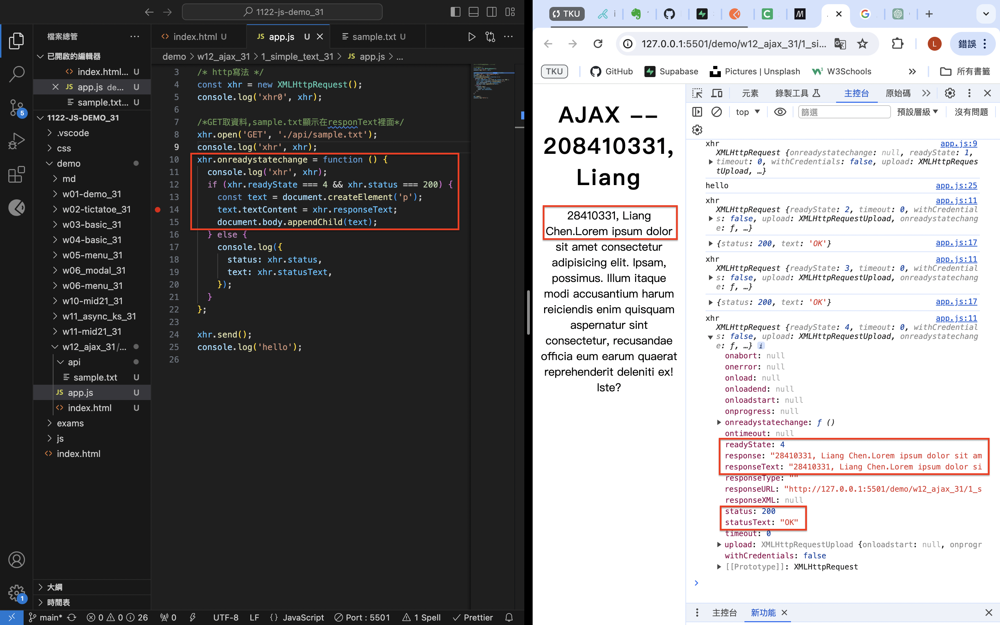
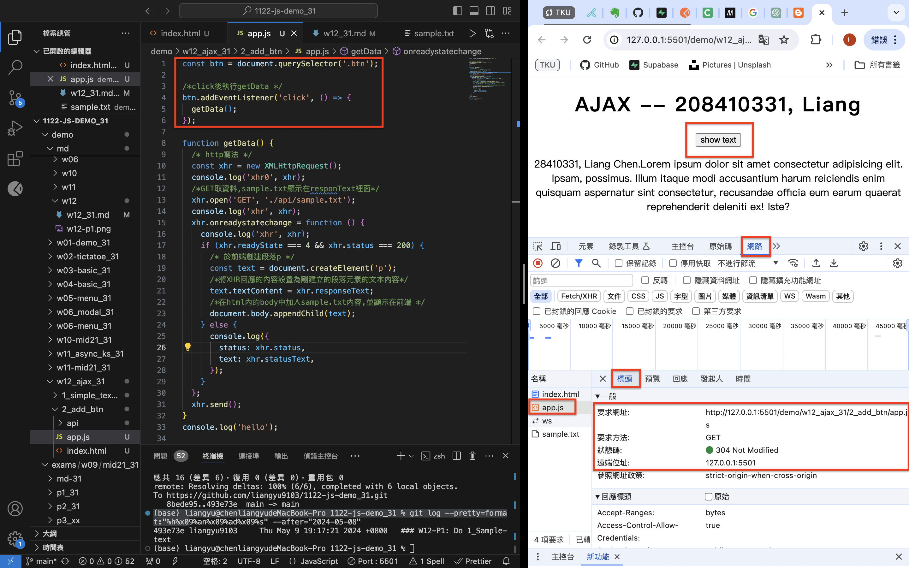
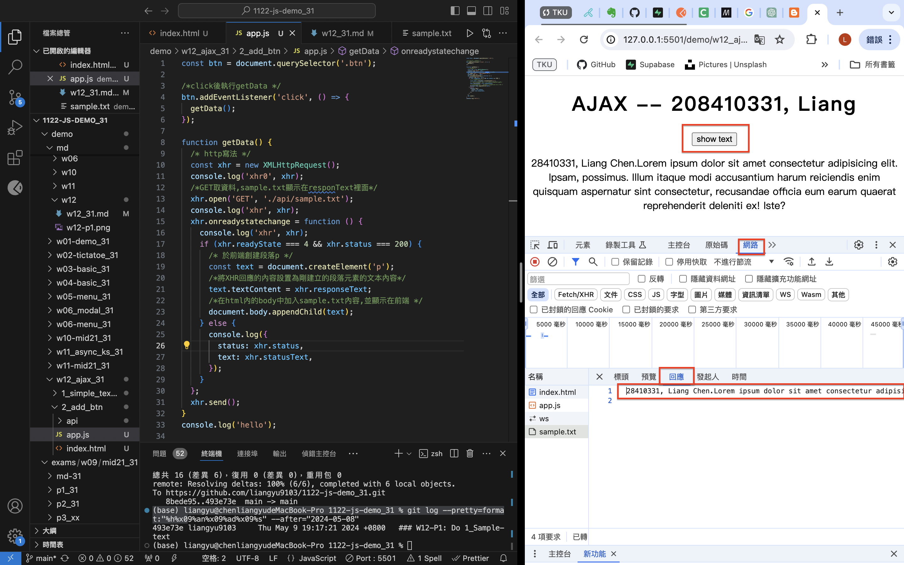
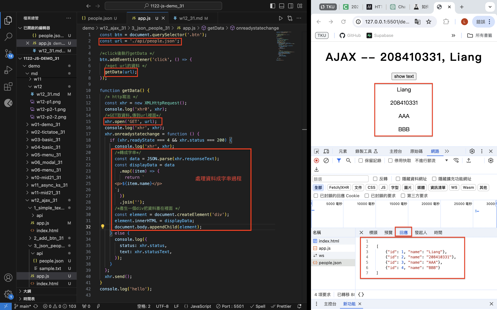
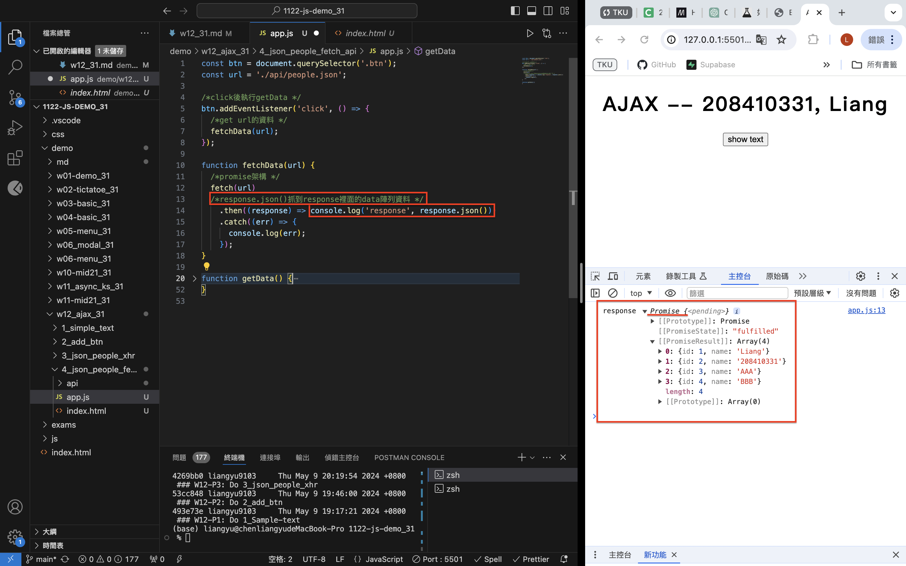
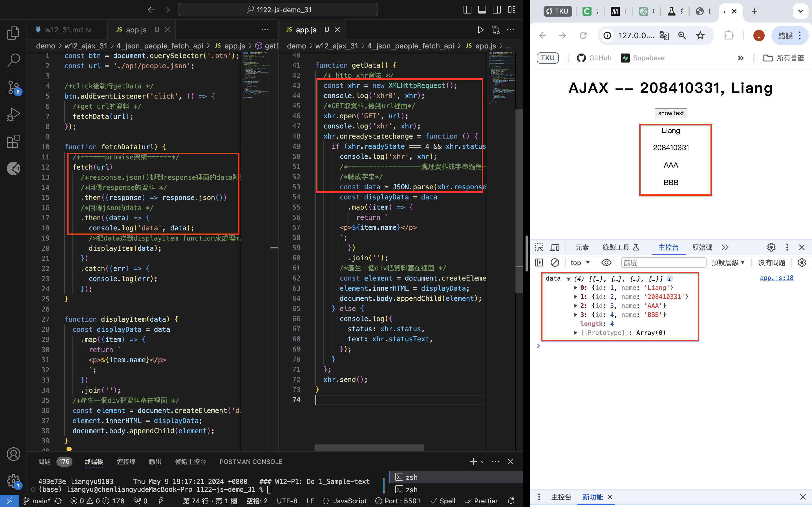
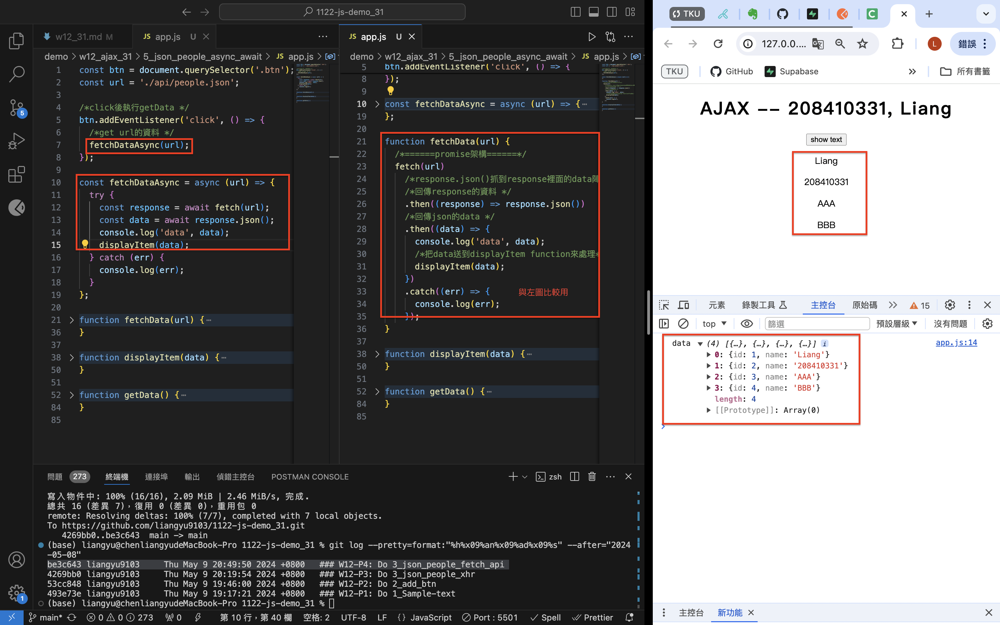

[Github](https://github.com/liangyu9103/1122-js-demo_31.git)
[Vercal](https://vercel.com/liangyu9103s-projects/1122-js-demo-31)

### W12-P1: Do 1_Sample-text



```
493e73e liangyu9103     Thu May 9 19:17:21 2024 +0800   ### W12-P1: Do 1_Sample-text
```

### W12-P2: Do 2_add_btn

#### => Network, Header



#### => Network, Response



```
53cc848 liangyu9103     Thu May 9 19:46:00 2024 +0800   ### W12-P2: Do 2_add_btn
```

### W12-P3: Do 3_json_people_xhr



```
4269bb0 liangyu9103     Thu May 9 20:19:54 2024 +0800   ### W12-P3: Do 3_json_people_xhr
```

### W12-P4: Do 3_json_people_fetch_api

#### => fetch(url).then(response => response.json())



#### => fetch api vs.xhr



```
be3c643 liangyu9103     Thu May 9 20:49:50 2024 +0800   ### W12-P4: Do 3_json_people_fetch_api
```

### W12-P5: Do 3_json_people_async_await



### W12-P6: w12 all code and log

```
git log --pretty=format:"%h%x09%an%x09%ad%x09%s" --after="2024-05-08"

7c317d6 liangyu9103     Thu May 9 21:09:46 2024 +0800   ### W12-P5: Do 3_json_people_async_await
be3c643 liangyu9103     Thu May 9 20:49:50 2024 +0800   ### W12-P4: Do 3_json_people_fetch_api
4269bb0 liangyu9103     Thu May 9 20:19:54 2024 +0800   ### W12-P3: Do 3_json_people_xhr
53cc848 liangyu9103     Thu May 9 19:46:00 2024 +0800   ### W12-P2: Do 2_add_btn
493e73e liangyu9103     Thu May 9 19:17:21 2024 +0800   ### W12-P1: Do 1_Sample-text
```
