[My Github URL](https://github.com/liangyu9103/final_31)

[My Vercel Homepage]()

# API Project 簡要說明

#### 重點 1

#### 重點 2

#### 重點 3

#### 重點 4

#### 重點 5

---

# API 資料及網路資源來源說明

#### 網路資源來源 1

[URL1](https://zh.wix.com/website-template/view/html/2786?originUrl=https%3A%2F%2Fzh.wix.com%2Fwebsite%2Ftemplates%2Fhtml%2Fblog%2Ffood-travel%2F2&tpClick=view_button&esi=054a4dc4-3907-4aa9-9705-01a90d6bba94)

#### 網路資源來源 2

[URL2](https://www.cakeresume.com/portfolios/cocktail-info-app-frontend)

#### 網路資源來源 3

---

# 後端 Supabase 資料庫設計

#### SQL schema and data

##### => table 1

> 1. 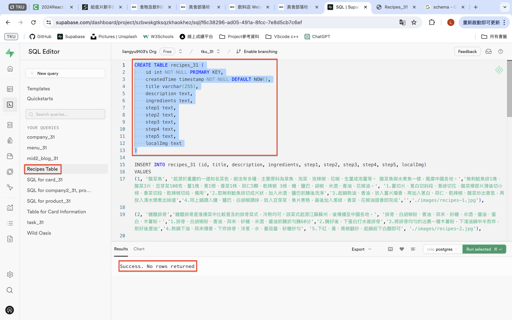
> 2. 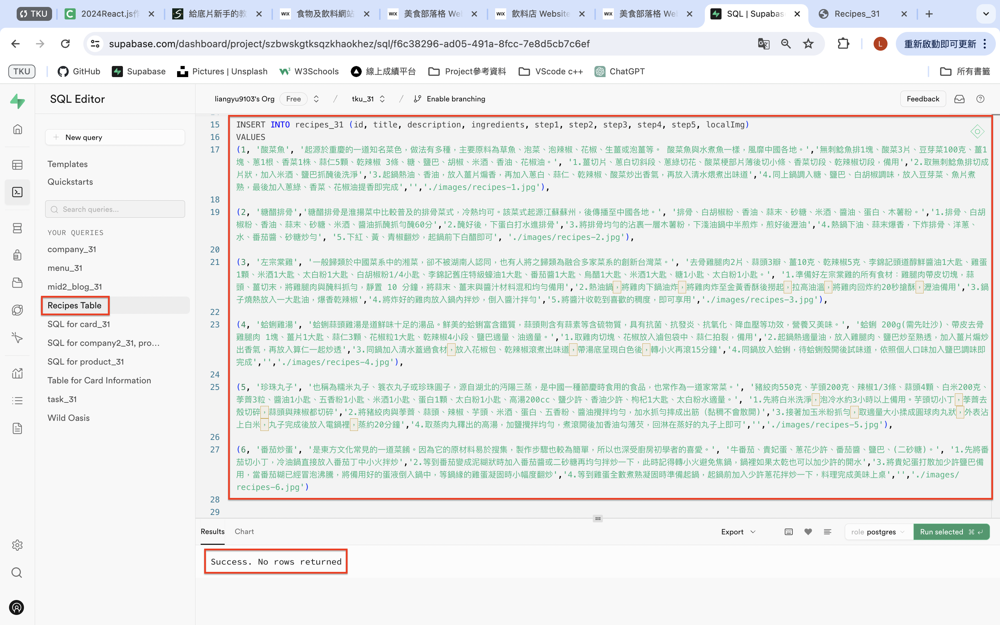
> 3. 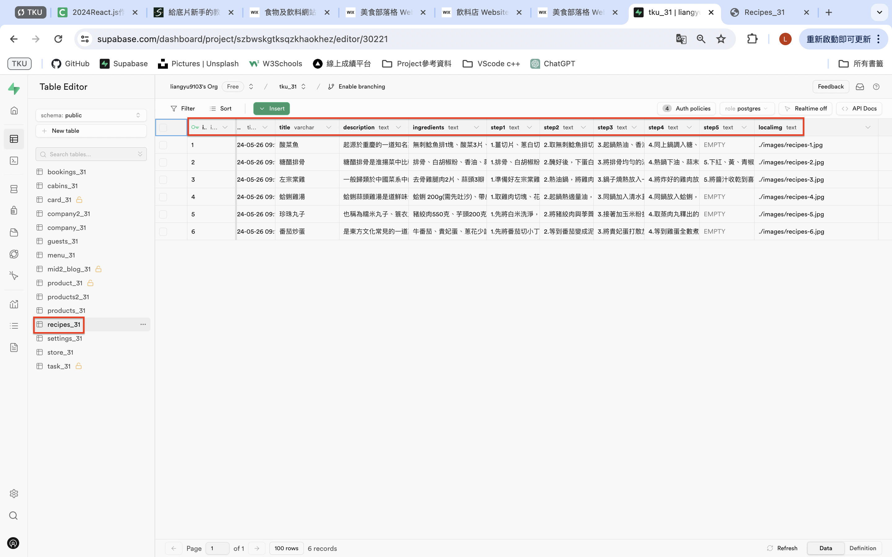

##### => 提供執行一次就可重新建立 schema 及 data 之 SQL 指令

```
--------------------
--delete table
--------------------
DROP TABLE recipes_31
--------------------
--delete table data
--------------------
TRUNCATE TABLE recipes_31

```

---

#### 前端程式設計說明

##### => 功能 1

##### => 功能 2

##### => 功能 3

##### => 功能 4

##### => 功能 5

---

### 解決問題說明

#### => 問題 1

- 問題：建立 recipesSupabase_31.js 取得 supabase 的 URL 以及 ANON_KEY，並 import 進 recipes_31.js,執行後發現 console 報錯(圖 1),沒有顯示 supabase 所建立的 6 筆資料(圖 2)

> 圖 1
> 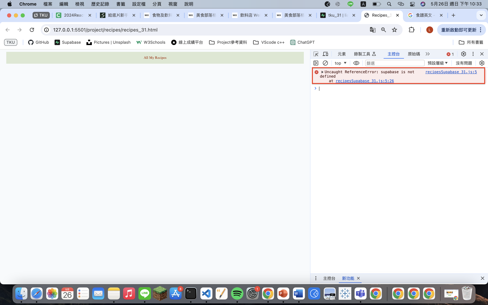
> 圖 2
> 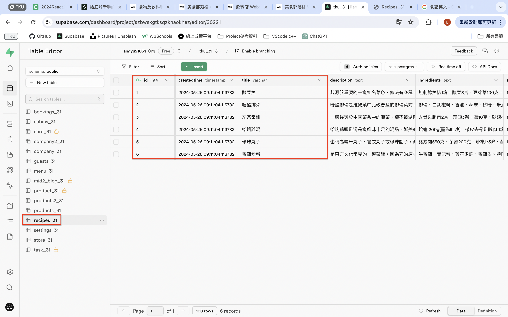

---

- 解決：發現是 recipes_31.html 下的 module 寫反了(圖 3),更正過後可以正常顯資料(圖 4)(此時還沒將圖片放進 local 端,故未顯示圖片)

> 圖 3
> 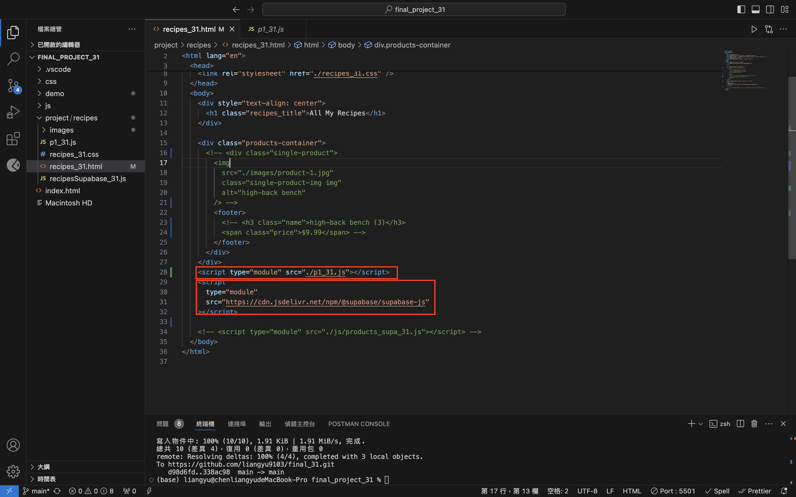
> 圖 4
> 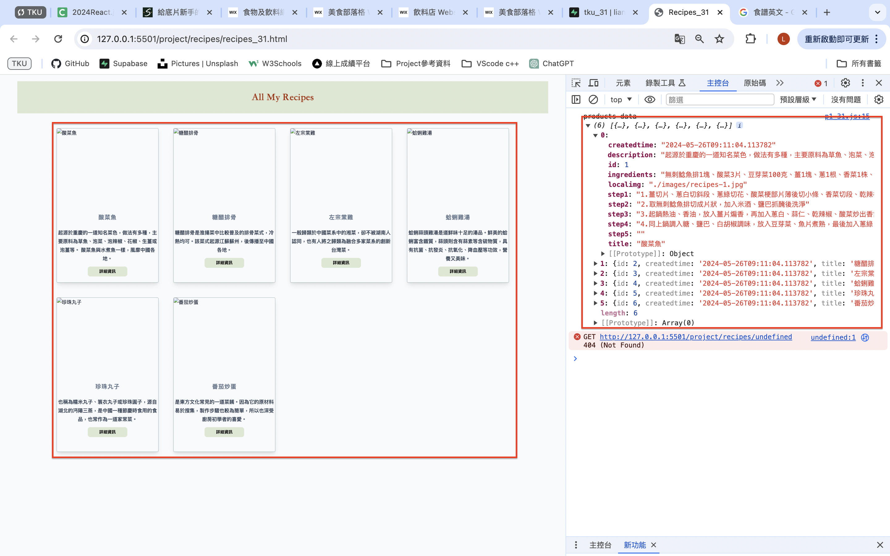

#### => 問題 2

- 問題：因為 Description 的字數不一，導致 Button 的位置會沒辦法對齊(圖 1)

> 圖 1
> 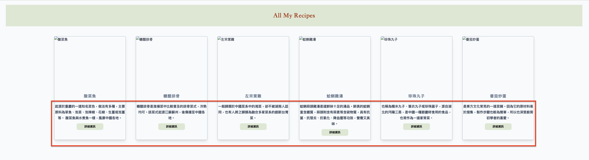

---

- 解決：設定 display 為 flex,flex-direction 為 column,flex 皆為 1(圖 2),且 description 也再設定接近為 120px(圖 3),就可成功對齊(圖 4)

> 圖 2
> 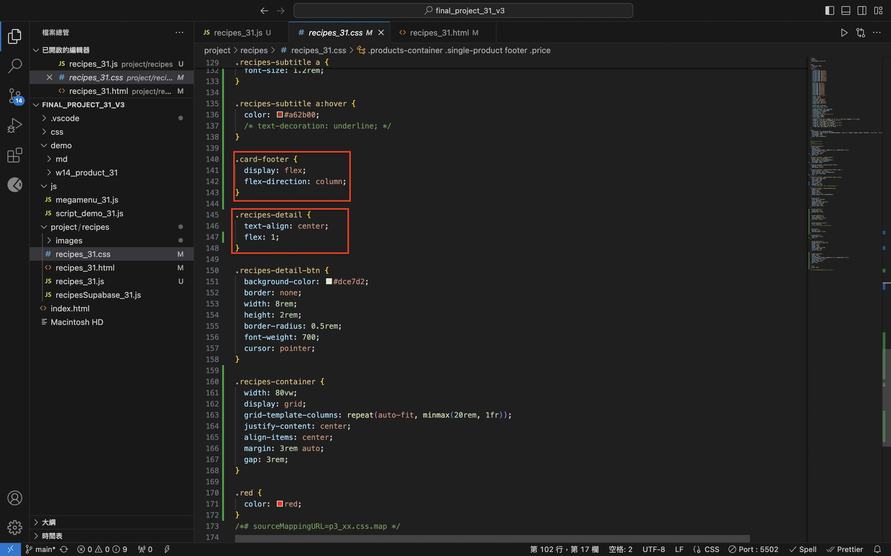
> 圖 3
> 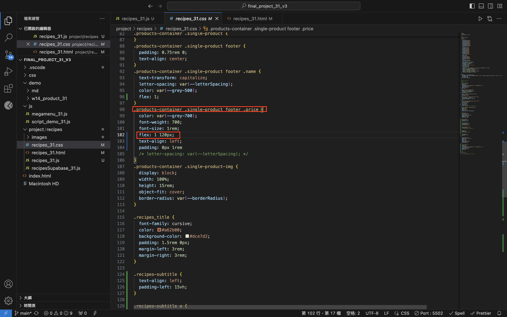
> 圖 4
> 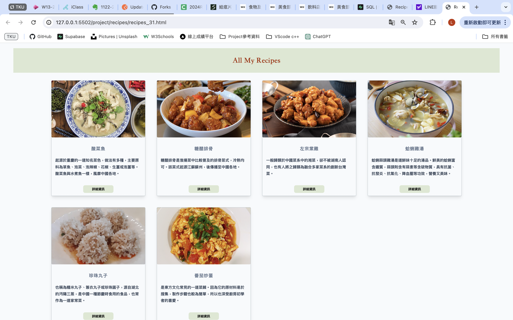

#### => 問題 3

#### => 問題 4

#### => 問題 5

---

### 學習甘苦談

#### => 1.

開發前期：選定以及構思 Project 方向花了不少時間.猶豫要用全新的去刻，還是使用老師上課模板加上參考網路資料去進行修改,後來考慮到時間以及作業複雜程度,選擇以老師上課的基本架構去修改以及增加內容.

主題的選擇也是從我的興趣來做發想！！

#### => 2.

#### => 3.

#### => 4.

#### => 5.
